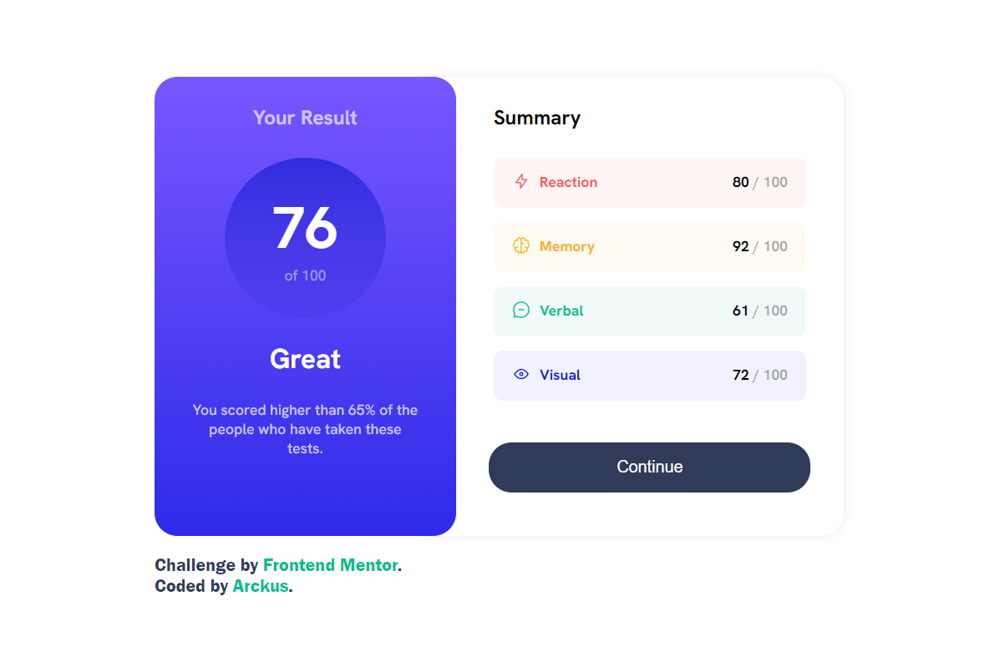
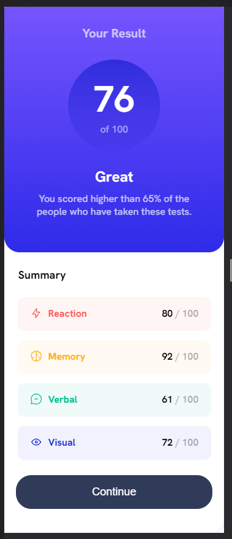
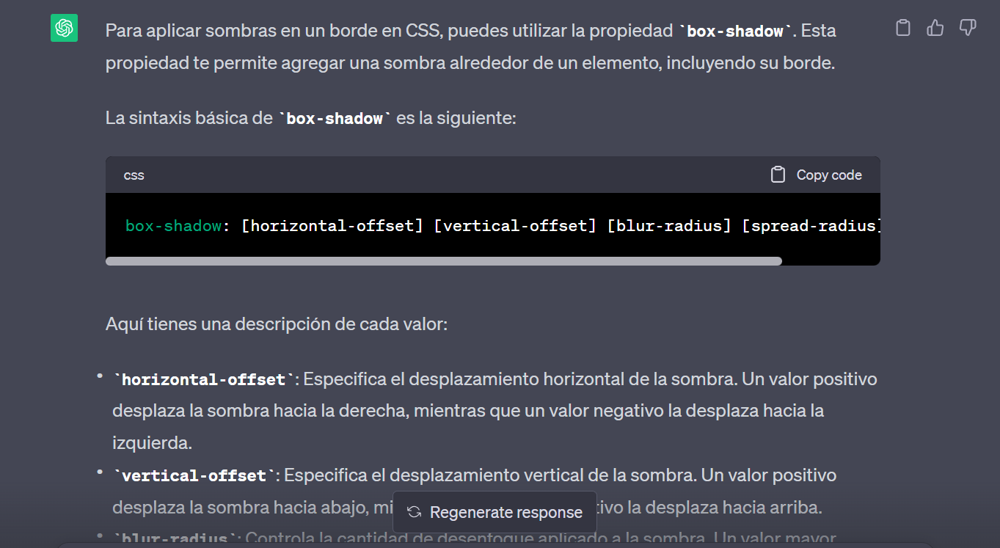

# Frontend Mentor - Results summary component solution

This is a solution to the [Results summary component challenge on Frontend Mentor](https://www.frontendmentor.io/challenges/results-summary-component-CE_K6s0maV). Frontend Mentor challenges help you improve your coding skills by building realistic projects. 

## Table of contents

- [Overview](#overview)
  - [The challenge](#the-challenge)
  - [Screenshot](#screenshot)
  - [Links](#links)
- [My process](#my-process)
  - [Built with](#built-with)
  - [What I learned](#what-i-learned)
  - [Continued development](#continued-development)
  - [Useful resources](#useful-resources)
- [Author](#author)

## Overview
This challenge was built with HTNL and CSS, some basic knowledge of media-query and responsive web design.

### The challenge

Users should be able to:

- View the optimal layout for the interface depending on their device's screen size
- See hover and focus states for all interactive elements on the page

### Screenshot

### Links

- Solution URL: https://github.com/Arckus1256/Results-Summary-Component.git
- Live Site URL: https://github.com/Arckus1256/Arckus1256.github.io

## My process

### Built with

- Semantic HTML5 markup
- CSS custom properties
- Flexbox

### What I learned

With this project I put into practice HTML, CSS, media-query and learned that certain functionalities can be implemented in different ways.

### Continued development

The areas that I will continue to learn in order to implement better functionalities in future projects would be:
-JS
-Bootstrap
-React Js
-SASS

### Useful resources

I used chatGPT as a query tool (but not to give me the code done), with this tool I could efficiently search for concepts that I forgot and needed to implement in the development of the project.

This is an example of a search I needed 

## Author

- Frontend Mentor - [@Arckus1256] https://www.frontendmentor.io/profile/Arckus1256
- Twitter - [@Arckus1256] https://twitter.com/Arckus1256

